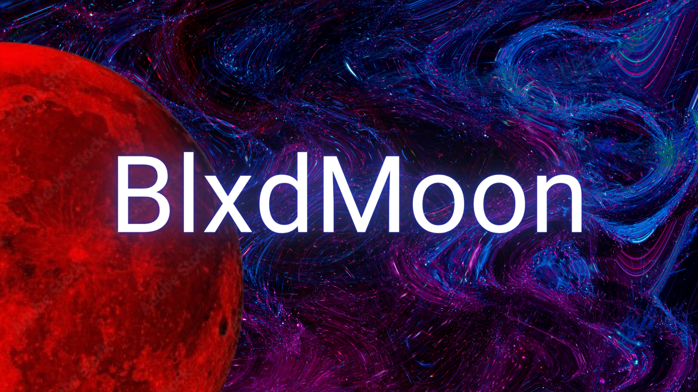

# BlxdMoon

> 📌 **Make sure to set correct IP Addresses & Ports in server.c and backdoor.c.**


[](repo/banner.png)

## Features

- [x] Connection to a custom-set server
- [x] Receive commands from server, execute them and send back results
- [] Automatically start program, when machine is re-booted
- [x] Start/Spawn other programs
- [x] Navigate through the file system
- [] Keylogger functionality (in development)
- [] Persistence (in development)

## Compilation

Server:

```bash
gcc src/server.c -lws2_32 -o bin/server.exe
```

Backdoor:

```bash
gcc src/backdoor.c -lws2_32 -o bin/backdoor.exe
```

## Usage

To run the server, simply execute bin/server.exe:

```bash
bin/server.exe
```

And to run the backdoor, execute bin/backdoor.exe:

```bash
bin/backdoor.exe
```

## License

[MIT](LICENSE)

```
MIT License

Copyright (c) 2023 FujiwaraChoki

Permission is hereby granted, free of charge, to any person obtaining a copy
of this software and associated documentation files (the "Software"), to deal
in the Software without restriction, including without limitation the rights
to use, copy, modify, merge, publish, distribute, sublicense, and/or sell
copies of the Software, and to permit persons to whom the Software is
furnished to do so, subject to the following conditions:

The above copyright notice and this permission notice shall be included in all
copies or substantial portions of the Software.

THE SOFTWARE IS PROVIDED "AS IS", WITHOUT WARRANTY OF ANY KIND, EXPRESS OR
IMPLIED, INCLUDING BUT NOT LIMITED TO THE WARRANTIES OF MERCHANTABILITY,
FITNESS FOR A PARTICULAR PURPOSE AND NONINFRINGEMENT. IN NO EVENT SHALL THE
AUTHORS OR COPYRIGHT HOLDERS BE LIABLE FOR ANY CLAIM, DAMAGES OR OTHER
LIABILITY, WHETHER IN AN ACTION OF CONTRACT, TORT OR OTHERWISE, ARISING FROM,
OUT OF OR IN CONNECTION WITH THE SOFTWARE OR THE USE OR OTHER DEALINGS IN THE
SOFTWARE.
```

## Notice

This project is for educational purposes only. I am not responsible for any
damage done by this software.

## Credits

BlxdMoon by [@FujiwaraChoki](https://github.com/FujiwaraChoki)
